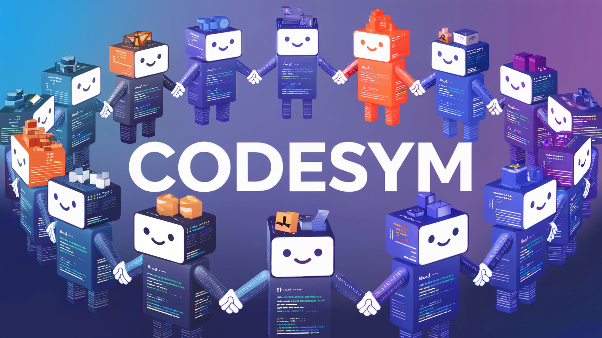

# CodeSym

## Overview

CodeSym is an experimental, agent-based auto-coding system. It aims to explore a new paradigm for code generation where functions and other code elements act as autonomous agents within a multi-agent system.

## License

This project is licensed under the MIT License - see the [LICENSE](LICENSE) file for details.